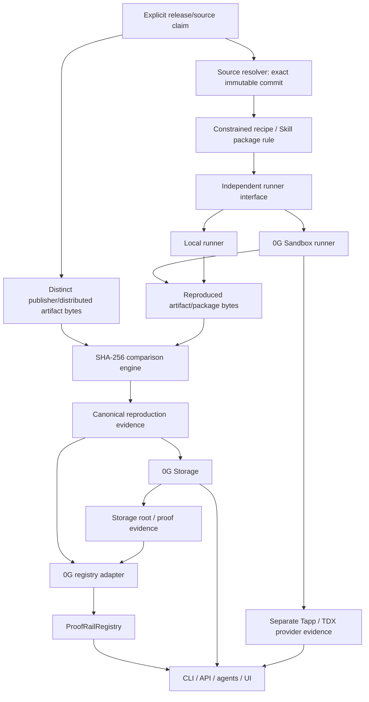
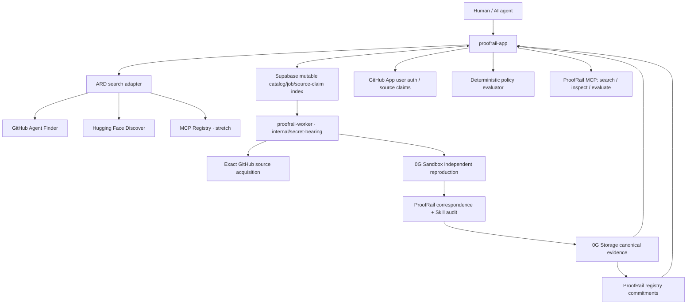

# Architecture

## Architecture goal

Keep ProofRail's trust/evidence model provider-independent while using 0G where independent execution, durable evidence, and public commitments materially reduce trust.

M8 adds **capability discovery, source authentication, mutable cataloging, consumer policy and agent access** around the already-proven verification engine. It does not replace the M1–M7 trust boundary.

## Proven verification data flow



For Agent Skills, deterministic security auditing is a **parallel** analysis path over the Skill package and never rewrites correspondence.

## M8 backend topology

Production remains exactly two permanent Railway services plus the existing ProofRail Supabase project:



### Roles

- **ProofRail app = public control/read plane.** ARD/search, versioned resource/evidence reads, GitHub source-authentication web flow, deterministic policy endpoint, and later MCP transport.
- **Supabase = mutable app/catalog memory.** Discovery observations, stable resource/version IDs, source-claim observations, job lifecycle, and pointers/caches. It is not proof authority.
- **ProofRail worker = secret-bearing execution plane.** Controlled verification orchestration, exact source acquisition, 0G execution/storage/registry writes, and optional cryptographic artifact-attestation tooling.
- **0G Sandbox = independent reproducer.** Reconstructs the supported artifact/package from exact claimed source.
- **0G Storage = durable evidence store.** Holds canonical ProofRail evidence.
- **0G registry = immutable commitment layer.** Holds compact commitments rather than large logs.

No third permanent Railway microservice is required for M8.

## M8 capability discovery flow

```text
user/agent intent
      ↓
ProofRail ARD/search
      ↓
provider adapters
      ↓
normalized CapabilityResource
      ↓
mutable catalog/cache
      ↓
available ProofRail evidence joined by stable resource/version
      ↓
consumer policy
      ↓
ALLOW / REVIEW / DENY
```

Discovery and trust are deliberately separate:

- upstream provider result -> `INDEXED` discovery state;
- high relevance -> still only relevance;
- upstream `trustManifest`/`verified` -> provider metadata only;
- only ProofRail evidence validators may populate source assurance/correspondence/security/canonical evidence fields.

## Source authentication architecture

M8.5 separates **source resolution** from **source authentication**.

### Resolution

A repository URL + exact commit exists and can be independently retrieved.

This can support `DECLARED` source assurance but does not prove publisher authority.

### Repository authentication

A GitHub App user authorization flow proves an authenticated GitHub identity has sufficient effective write/push or admin-equivalent authority over the **stable GitHub repository ID** at claim time.

ProofRail then canonicalizes the exact source claim:

```text
stable repository identity
+ exact commit SHA
+ optional subdirectory
+ resource/version identity
+ optional distinct distribution reference/digest
+ authenticated GitHub authority observation
      ↓
canonical source claim
      ↓
SHA-256 sourceClaimDigest
```

That may earn:

`REPOSITORY_AUTHENTICATED`

This assurance is historical evidence at claim time. It is not a safety statement.

### Signed release

`SIGNED_RELEASE` is a stronger optional path only when cryptographic provenance/signature verification succeeds under explicit expected artifact/repository/source/signer constraints.

GitHub Artifact Attestation listing alone is insufficient.

Detailed design: `docs/14-source-authentication.md`.

## Agent Skill verification architecture — PROVEN M7, reused in M8

Agent Skills are the initial fully verified capability family because their distributed instruction/code bundles can be deterministically packaged and compared against an independently produced package from an exact source revision.

Two distinct modes matter:

### Source inspection only

```text
exact source commit/subdirectory
      ↓
retrieve + parse + canonical package + audit
```

Legitimate output:

- source inspection = `INSPECTED`
- security findings = available if audit completed
- correspondence = `NOT_EVALUATED` / `INSUFFICIENT_EVIDENCE`

There is no meaningful `MATCH` without a distinct distributed/publisher artifact.

### Distribution correspondence

```text
separate distributed Skill package
              ↓ SHA-256
              VS
exact claimed source commit
              ↓
independent canonical Skill package
              ↓ SHA-256
```

Only this path emits normal ProofRail `MATCH` / `MISMATCH` / `DIVERGED` states.

Skill security auditing remains orthogonal. Valid combinations include:

- `MATCH + no high-risk findings`
- `MATCH + HIGH/CRITICAL findings`
- `MISMATCH + no findings`
- `MISMATCH + findings`

A `MATCH` never means the Skill is safe.

## Component boundaries

### `packages/core`

Owns original provider-independent source/release claim, hashing, canonical evidence, correspondence statuses, validation and resource-limit primitives.

It must not import 0G SDKs, Supabase clients, ARD schemas, GitHub provider schemas or LLM APIs.

### `packages/capability-model`

M8.1 provider-independent capability/evidence/policy model.

Owns:

- resource kinds;
- discovery-state abstraction;
- source assurance abstraction;
- source inspection/correspondence/security/canonical evidence dimensions;
- deterministic consumer policy evaluation.

It remains ARD/GitHub/Supabase/MCP-provider agnostic.

### `packages/discovery-ard` — M8.2

Owns the pinned ARD request/response/catalog mapping and local deterministic search/conformance surface.

### `packages/discovery-providers` — M8.3

Owns provider adapters such as GitHub Agent Finder and Hugging Face Discover.

Fixed upstream origins, strict timeouts/limits/validation. Provider data maps only to discovery state.

### `packages/catalog-store` — M8.4

Recommended mutable catalog abstraction around Supabase.

Owns resource/version/discovery/ingestion/source-claim/evidence-pointer persistence without becoming proof authority.

### `packages/source-auth-github` — M8.5

Recommended GitHub-specific source-auth adapter.

Owns OAuth/user installation/permission resolution, stable repository identity observations and canonical source-claim authentication evidence.

Does not enter `packages/core`/capability model with raw GitHub schemas.

### `packages/job-store`

Existing mutable application job boundary. Reuse where useful for verification orchestration; do not create a second competing job lifecycle without need.

### `packages/runner-local`

Controlled deterministic runner used for development/tests and baseline reproduction.

### `packages/sandbox-0g`

Adapter for the live 0G Sandbox/Tapp surfaces proven in M4/M7.

The currently proven public build path obtains exact immutable source, executes a constrained build/package step, retrieves artifact bytes, hashes them, and deletes the sandbox.

M4 also obtained separate provider TDX evidence. The current quote does not bind ProofRail's artifact digest; the architecture must not describe the build itself as TEE-output-attested.

Unavailable output binding remains explicit unavailable/provider-evidence-only state, not a reason to invent stronger claims.

### `packages/skill-audit`

Existing deterministic Agent Skill parsing/packaging/audit package. M8 reuses it; do not fork its correspondence/security semantics.

### `packages/storage-0g`

Stores canonical provenance/comparison evidence and retrieves it with proof verification where supported.

### `contracts/ProofRailRegistry.sol`

Stores compact commitments, not full logs.

### `packages/registry-0g`

Typed client for registry reads/writes.

### `packages/mcp-proofrail` — M8.8

Recommended thin transport adapter over existing application services.

Initial tools only:

- `proofrail_search`
- `proofrail_inspect`
- `proofrail_evaluate`

No auto-install/execute/sign/arbitrary-build tool.

### `apps/web` / `proofrail-app`

Public HTTP runtime.

M8 adds ARD/search, stable reads, source-auth web flow, policy and MCP routing here while preserving secret separation.

M9 later layers the human Hub UI over the frozen backend APIs.

### `apps/worker` / `proofrail-worker`

Current production worker is intentionally secret-bearing and publicly non-mutating.

M8 may expand its internal orchestration for authorized verification, but must not expose a public generic execution/signing surface.

The 0G private key remains worker-only.

## Supabase data architecture

M8 extends the existing ProofRail Supabase project rather than creating a new database.

Planned normalized areas:

- logical resources;
- provider discovery observations;
- exact resource versions/source/distribution refs;
- source claims;
- source-authority observations;
- verification evidence pointers;
- ingestion provider state.

RLS remains enabled. Public browser clients need not write these tables directly; the versioned ProofRail API is the product contract.

Detailed schema: `docs/16-m8-database-plan.md`.

## API architecture

### Discovery

```text
GET  /.well-known/ai-catalog.json
POST /search
```

### Stable M8 reads/policy

```text
GET  /api/v1/resources/:resourceId
GET  /api/v1/resources/:resourceId/versions/:versionId
GET  /api/v1/resources/:resourceId/evidence
POST /api/v1/policy/evaluate
```

### GitHub source auth/claim

```text
GET  /auth/github/start
GET  /auth/github/callback
GET  /api/v1/source-auth/github/repositories
POST /api/v1/source-claims
GET  /api/v1/source-claims/:claimId
```

Expensive verification remains internal/authorized; public search/inspect/policy never implicitly spends 0G.

## Verification/assurance dimensions

Do not collapse everything into one green badge.

- **Discovery Indexed** — a provider/catalog knows about the resource; no ProofRail trust implied.
- **Source Declared** — explicit mapping exists; publisher authority not proven.
- **Repository Authenticated** — real GitHub repository-authority evidence exists for the exact claim.
- **Signed Release** — reserve for actually cryptographically verified provenance/signature under expected identity constraints.
- **Source Inspected** — exact immutable source was independently inspected.
- **Artifact Correspondence Match** — distinct distributed bytes equal independent exact-source reproduction bytes.
- **Skill Audit Findings** — separate deterministic security analysis.
- **Canonical Evidence Available** — integrity-protected evidence/pointers are available/freshness known.
- **TEE Provider Evidence** — real provider/runtime TEE evidence exists.
- **TEE Attested Build** — reserved for future evidence that actually binds build/output commitment. Current M4/M7 do not satisfy it.
- **Consumer Policy Result** — `ALLOW`, `REVIEW`, `DENY` under explicit requirements.
- **Consensus Verified** — future N-of-M builder policy only after multiple genuinely independent builders exist.

None means source code/Skill is safe by default.

## Scaling architecture

**Discovery is cheap; independent reproduction is expensive; evidence verification is cheap again.**

ProofRail can index/search many resources without independently rebuilding them all. Expensive verification happens only for selected supported versions/jobs. Many consumers can then reuse/verify the resulting canonical evidence.

This model keeps M8 viable on current solo-builder infrastructure and avoids an expensive global crawler/build farm.

## M8 → M9 boundary

Issue #30 / M8.11 freezes security and backend JSON/MCP contracts before the frontend begins.

M9 frontend consumes those contracts; it does not read raw Supabase tables or invent client-side trust logic.

Detailed M8 blueprint: `docs/13-m8-backend-blueprint.md`.
