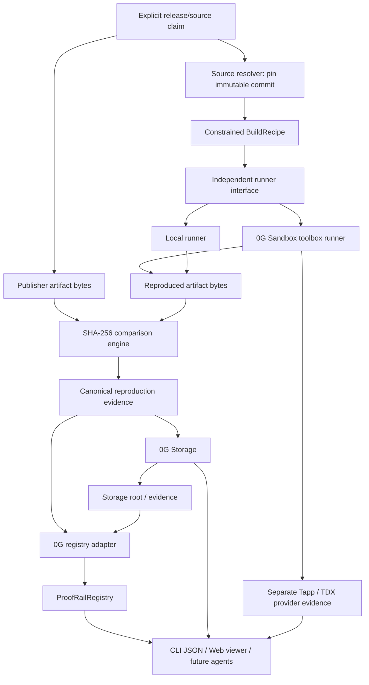

# Architecture

## Architecture goal

Keep the trust model provider-independent while using 0G where independent execution, durable evidence, and public commitments materially reduce trust.

## Wave 3 data flow

## Two independent trust questions

### 1. Source identity / declaration
Who says this repository+commit is the source for this release?

Possible assurance levels evolve independently:
- `DECLARED` — somebody supplied the mapping;
- `REPOSITORY_AUTHENTICATED` — a GitHub identity with required repository permission registered it;
- `SIGNED_RELEASE` — a recognized publisher key signed the mapping;
- future domain/package/onchain bindings.

Wave 3 may operate at `DECLARED` for the demo but must display that honestly.

### 2. Build correspondence
Does an independent rebuild of that exact source/recipe produce the same artifact bytes as the publisher distributes?

This is the core Wave 3 proof.

## Component boundaries

### `packages/core`
Owns source/release claim schema, artifact hashing, canonical evidence, verification statuses, trust-policy primitives, validation, and resource-limit models. It must not import 0G SDKs or LLM APIs.

### `packages/runner-local`
Controlled deterministic runner used for development/tests and as a baseline independent reproducer.

### `packages/sandbox-0g`
Adapter for the live hosted 0G Sandbox/Tapp surfaces proven in M4.

The currently proven public build path is:

1. discover a non-sealed provider and active snapshot;
2. authenticate requests with the disposable Galileo wallet;
3. toolbox-clone an exact immutable commit;
4. verify detached `.git/HEAD`;
5. execute the constrained build;
6. download the artifact bytes and hash them;
7. delete the sandbox.

M4 also reads TappRegistry metadata and obtains real TDX evidence from the provider's registered Tapp node. **These are separate evidence paths.** The live Tapp's quote v5 `report_data` is legacy provider-signer padding and does not bind the caller artifact digest. The public toolbox build is non-sealed, while the observed sealed-only provider rejects toolbox operations. Therefore the architecture must not describe the M4 build itself as confidential, sealed, TEE-computed, or output-attested.

### `packages/storage-0g`
Stores canonical provenance/comparison evidence and retrieves it with proof verification where supported.

### `contracts/ProofRailRegistry.sol`
Stores compact commitments, not full logs.

### `packages/registry-0g`
Typed client for registry reads/writes.

### `packages/cli`
Human and agent interface. Stable JSON is a product requirement.

### `apps/web`
Evidence visualization only. The UI must never become the sole source of verification truth.

## Scaling architecture

**Rebuilding is expensive; verifying is cheap.** A release is rebuilt once per selected builder/policy. Many consumers then hash their local artifact and verify existing evidence.

Wave 3 accepts only explicitly supported build targets and enforces resource limits. Unsupported or excessive jobs fail instead of consuming unbounded compute.

## Verification/assurance dimensions

Do not collapse everything into one green badge.

- **Source Declared** — mapping exists, publisher ownership not necessarily proven.
- **Publisher Authenticated** — ownership/signature evidence for the source claim exists.
- **Artifact Integrity Match** — local bytes match a registered publisher artifact digest.
- **Independently Reproduced** — independent builder output matches publisher artifact bytes.
- **TEE Provider Evidence** — real TEE evidence exists for the registered provider/runtime identity.
- **TEE Attested Build** — reserve this stronger label for a future path where evidence actually proves the measured build execution and binds the relevant output/commitment. M4 does not satisfy it.
- **Consensus Verified** — explicit N-of-M independent-builder policy is satisfied.

None of these means the source code is safe.
