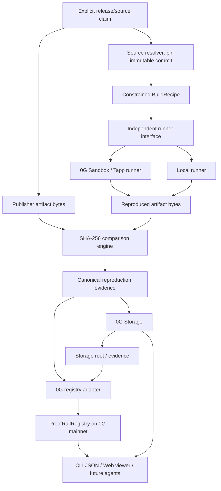

# Architecture

## Architecture goal

Keep the trust model provider-independent while using 0G where confidential execution, durable evidence, and public commitments materially reduce trust.

## Wave 3 data flow

## Two independent trust questions

### 1. Source identity / declaration
Who says this repository+commit is the source for this release?

Possible assurance levels evolve independently:
- `DECLARED` — somebody supplied the mapping;
- `REPOSITORY_AUTHENTICATED` — a GitHub identity with required repository permission registered it;
- `SIGNED_RELEASE` — a recognized publisher key signed the mapping;
- future domain/package/onchain bindings.

Wave 3 may operate at `DECLARED` for the demo but must display that honestly.

### 2. Build correspondence
Does an independent rebuild of that exact source/recipe produce the same artifact bytes as the publisher distributes?

This is the core Wave 3 proof.

## Component boundaries

### `packages/core`
Owns:
- source/release claim schema;
- artifact hashing;
- canonical provenance/comparison representation;
- verification statuses;
- trust-policy primitives;
- validation and resource-limit configuration models.

Must not import 0G SDKs or LLM APIs.

### `packages/runner-local`
Controlled deterministic runner used for development/tests and as a baseline independent reproducer.

### `packages/runner-0g`
Adapter around the proven 0G confidential execution flow. It returns explicit capabilities and raw evidence references; unsupported attestation properties remain unavailable.

### `packages/storage-0g`
Stores canonical provenance/comparison evidence and retrieves it with proof verification where supported.

### `contracts/ProofRailRegistry.sol`
Stores compact commitments, not full logs.

Candidate fields:
- source/release claim commitment;
- immutable commit identifier/hash;
- publisher artifact digest;
- reproduced artifact digest or reproduction-evidence root;
- provenance/storage root;
- builder/evidence commitment;
- submitter/event/timestamp.

### `packages/registry-0g`
Typed client for registry reads/writes.

### `packages/cli`
Human and agent interface. Stable JSON is a product requirement.

### `apps/web`
Evidence visualization only. The UI must never become the sole source of verification truth.

## Scaling architecture

**Rebuilding is expensive; verifying is cheap.** A release is rebuilt once per selected builder/policy. Many consumers then hash their local artifact and verify existing evidence.

Wave 3 accepts only explicitly supported build targets and enforces resource limits. A huge monorepo may specify a target subdirectory/package; unsupported or excessive jobs fail instead of consuming unbounded compute.

## Verification/assurance dimensions

Do not collapse everything into one green badge.

- **Source Declared** — mapping exists, publisher ownership not necessarily proven.
- **Publisher Authenticated** — ownership/signature evidence for the source claim exists.
- **Artifact Integrity Match** — local bytes match a registered publisher artifact digest.
- **Independently Reproduced** — independent builder output matches publisher artifact bytes.
- **TEE Attested Build** — supported attestation proves the measured execution environment; output binding is only claimed if actually proven.
- **Consensus Verified** — explicit N-of-M independent-builder policy is satisfied.

None of these means the source code is safe.
