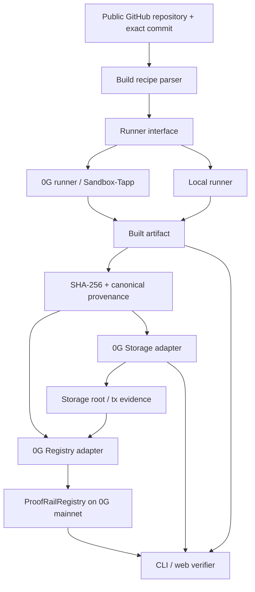

# Architecture

## Architecture goal

Keep the verification model portable while using 0G for the parts where decentralization/confidential execution materially reduce trust.

## Component boundaries

### `packages/core`
Owns:
- artifact digest calculation;
- canonical manifest representation;
- verification result model;
- trust/verification levels;
- validation rules.

Must **not** import 0G SDKs.

### `packages/runner-local`
A deterministic local runner used for development, tests, and comparison.

### `packages/runner-0g`
Adapter around the supported 0G confidential execution flow.

It must return explicit evidence fields such as:
- environment/provider identifier;
- sandbox/build identifier;
- available attestation evidence;
- logs/retrieval metadata;
- unsupported attestation fields as `null`/unavailable.

### `packages/storage-0g`
Uploads canonical provenance evidence and retrieves it with proof verification where supported.

### `contracts/ProofRailRegistry.sol`
Stores minimal commitments rather than full provenance documents.

Candidate record fields:
- project/source identifier hash;
- source commit;
- artifact digest;
- provenance/storage root;
- builder/evidence commitment;
- submitter;
- timestamp/event.

### `packages/registry-0g`
Typed client around the registry contract.

### `packages/cli`
Developer-facing `build`, `verify`, and `inspect` commands. Wave 3 only requires a minimal coherent subset.

### `apps/web`
Public human-readable verification interface. It must not become the source of truth; it visualizes evidence independently available elsewhere.

## Trust boundaries

1. **Publisher/source control** — A malicious maintainer can publish malicious source. ProofRail does not solve this.
2. **Builder** — A builder could claim an output it did not honestly build. TEE attestation and independent rebuilds progressively reduce this risk.
3. **ProofRail backend** — Must not be trusted to rewrite evidence; commitments/evidence should remain independently checkable.
4. **Storage** — Evidence retrieval/integrity should be verified against its cryptographic root.
5. **Registry** — Historical commitments should be independently readable from 0G Chain.
6. **Verifier UI** — The UI can lie; CLI/raw evidence should permit independent checking.

## Verification levels

The UI must distinguish levels rather than show one vague `VERIFIED` badge:

- **Integrity Verified** — local file digest matches a registered artifact digest.
- **Source Attested** — a builder asserts the digest came from a specific source/recipe.
- **TEE Attested** — verifiable evidence shows the build execution environment is hardware-attested.
- **Reproduced** — multiple independent builders produced matching artifact digests.
- **Consensus Verified** — an explicit N-of-M trust policy is satisfied.

Wave 3 must only display levels actually supported by evidence.
